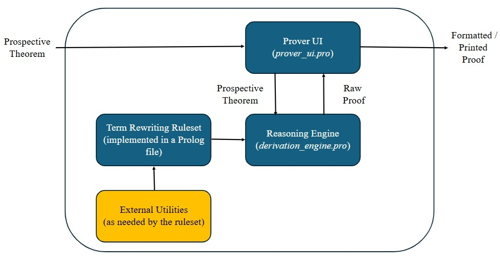
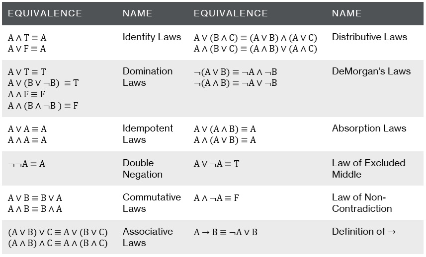
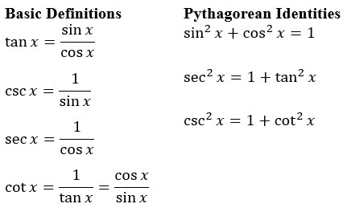

# Equational-Theorem-Proving
A Small Prolog Equational Theorem Proving System

This repository contains a small Prolog-based equational theorem proving system. Based on term rewriting, this system facilitates theorem proving by equational transformation based on user-defined term rewriting rules. A term rewriting rule specifes a left-hand side (LHS) and a right-hand (RHS) side together with a rule name. Expressions matching the LHS can be replaced with the corresponding RHS. Expressions are represented as Prolog lists. For example, the expression *a + b* is represented as `[a, +, b]`.

A theorem prover consists of three components:

1. The Reasoning Engine ([derivation_engine.pro](./derivation_engine.pro)): This core component produces the equational proofs.
2. A Term Rewriting Ruleset (for example, [tiny_ruleset.pro](./tiny_ruleset.pro)): This is a Prolog file that specifies the rewriting rules to be used. Creating a theorem prover for a new domain simply requires the creation of an appropriate ruleset.
3. The User Interface ([prover_ui.pro](./prover_ui.pro)): This receives input from the user, then formats and prints the resulting proofs.

The theorem prover architecture is depicted below:



Users can interact with the system in the Prolog command prompt via the top-level predicate *prove*, which has the following form:

*prove(Exp1, Exp2, MaxProofSteps)*

Here, Exp1 and Exp2 are two expressions (represented as Prolog lists) to be proven equal by at most the maximum number of proof steps.

Two small demo theorem provers are included: 1) a propositional logic equivalence prover, and 2) a trigonometric identity theorem prover.

## Demo 1: A Propositional Logic Equivalence Theorem Prover
This theorem prover can generate equational proofs for propositional equivalences using the axioms listed below:



These axioms are implemented as Prolog rules in the file [prop_equivalence.pro](./prop_equivalence.pro). 

Example proofs generated by this system are shown below for two problems taken from *Discrete Structures, Logic, and Computability* by James L. Hein (2nd. ed., p. 355 and 368):

```
?-consult('derivation_engine.pro').
true. 
 
?-consult('prop_equivalence.pro').
true. 
 
?-consult('prover_ui.pro').
true. 
 
?-prove([a,->,b], [[~,b],->,[~,a]], 7).
THEOREM: (a -> b) = ((~ b) -> (~ a))
PROOF:
(a -> b)
= (Definition of ->)
((~ a) or b)
= (Commutative)
(b or (~ a))
= (Double Negation)
((~ (~ b)) or (~ a))
= (Definition of ->)
((~ b) -> (~ a))
---
QED
 
?-prove([[[a,->,b], and ,a],->,b], true, 7).
THEOREM: (((a -> b) and a) -> b) = true
PROOF:
(((a -> b) and a) -> b)
= (Definition of ->)
((~ ((a -> b) and a)) or b)
= (DeMorgan)
(((~ (a -> b)) or (~ a)) or b)
= (Associative)
((~ (a -> b)) or ((~ a) or b))
= (Commutative)
(((~ a) or b) or (~ (a -> b)))
= (Definition of ->)
((a -> b) or (~ (a -> b)))
= (Excluded Middle)
true
---
QED
```

A larger sample of proofs generated by this system for additional problems (also taken from Hein, 2nd. ed., p. 355 and 368) can be found in [prop_equivalence_demo_proofs.txt](./prop_equivalence_demo_proofs.txt).

## Demo 2: A Trigonometric Identity Theorem Prover
This theorem prover can generate proofs for a restricted set of trigonometric identities by using the definitions and basic identities listed below:



The specific components of this theorem prover (in addition to the reasoning engine and UI discussed above) are as follows:

* [trig.pro](./trig.pro): This contains a set of rewrite rules for the basic trigonometric identities and definitions shown above as well as rules for many common algebraic manipulations useful in solving trigonometric identities.
  
* [math_util.pro](./math_util.pro): This contains a top-level predicate *simplify* (together with other utility predicates) that provides a restricted capability to simplify long mathematical expressions. Specifically, it can simplify additive expressions - those involving only addition, subtraction, and numeric multiples of variables (e.g., *2a + 4b + 3c +a - 7b + 2c* can be simplified to *3a - 3b + 5c*).

As this theorem prover is only for demonstration purposes, it has a number of limitations. First, it only uses the basic trigonometric identities and definitions listed above. Second, trigonometric functions (such as *sin*, *cos*, etc.) can only be applied to a single variable *x*, rather than to general expressions. Finally, the general simplification of expressions is limited to additive simplification. However, rewrite rules for common, specific multiplicative cases are included in trig.pro. Thus, although limitied in scope, this theorem prover can still prove a wide variety of trigonometric identities commonly found in textbooks.

An example proof generated by this prover is shown below for a problem taken from *Algebra and Trigonometry With Analytic Geometry* by Swokowski and Cole (8th. ed., p. 354).:

```
?-consult('derivation_engine.pro').
true. 

?-consult('math_util.pro').
true. 
 
?-consult('trig.pro').
true. 
 
?-consult('prover_ui.pro').
true. 

?-prove([sec(x),-,cos(x)], [tan(x),*,sin(x)], 8).
THEOREM: (sec(x) - cos(x)) = (tan(x) * sin(x))
PROOF:
(sec(x) - cos(x))
= (Def. SEC).
((1 / cos(x)) - cos(x))
= (Pythag. Ident.)
((((sin(x) ^ 2) + (cos(x) ^ 2)) / cos(x)) - cos(x))
= (Fraction Equivalence)
((((sin(x) ^ 2) / cos(x)) + ((cos(x) ^ 2) / cos(x))) - cos(x))
= (Def. Square)
((((sin(x) * sin(x)) / cos(x)) + ((cos(x) ^ 2) / cos(x))) - cos(x))
= (Fraction Equivalence)
((((sin(x) / cos(x)) * sin(x)) + ((cos(x) ^ 2) / cos(x))) - cos(x))
= (Def. TAN)
(((tan(x) * sin(x)) + ((cos(x) ^ 2) / cos(x))) - cos(x))
= (Division)
(((tan(x) * sin(x)) + cos(x)) - cos(x))
= (Simplify)
(tan(x) * sin(x))
---
QED
```

A larger sample of proofs generated by this system for additional problems (also taken from Swokowski and Cole, p. 354) can be found in [trig_identity_demo_proofs.txt](./trig_identity_demo_proofs.txt).

## Implementation Notes
This was developed and tested using [SWI Prolog](https://www.swi-prolog.org/), a free commercial grade Prolog system.

